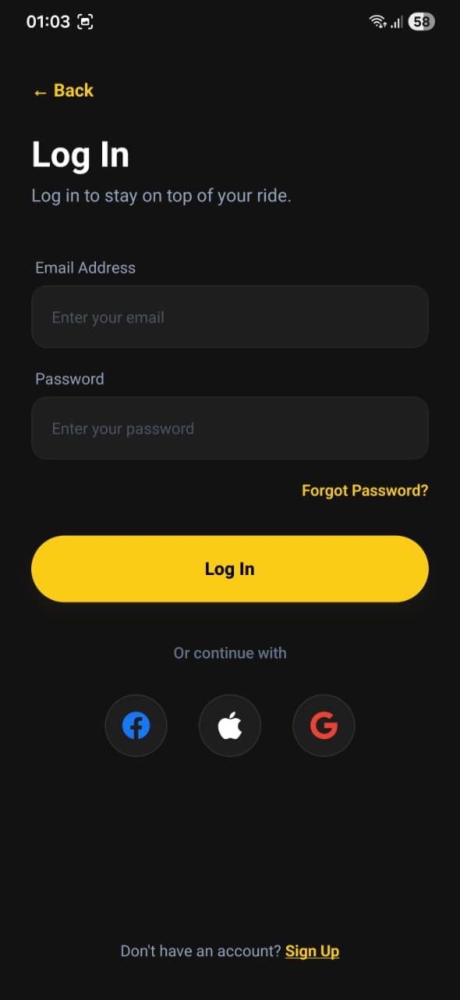
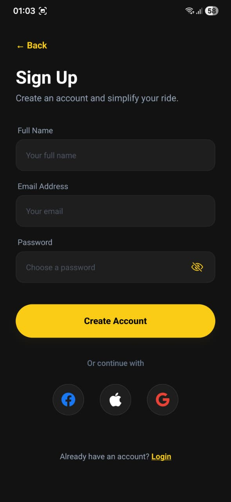
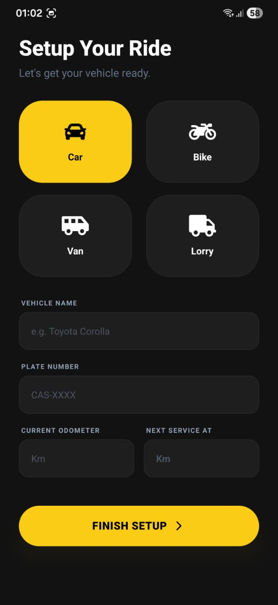
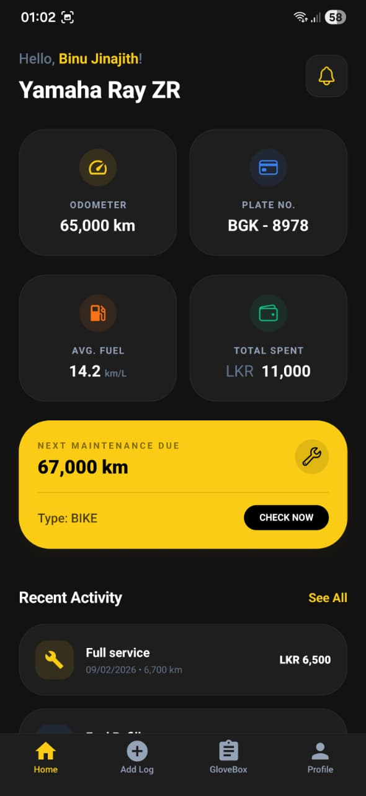
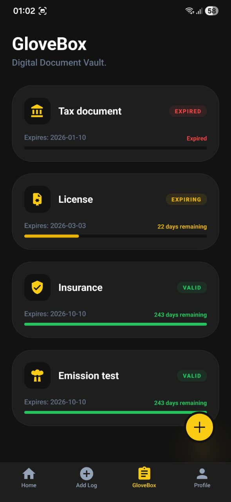
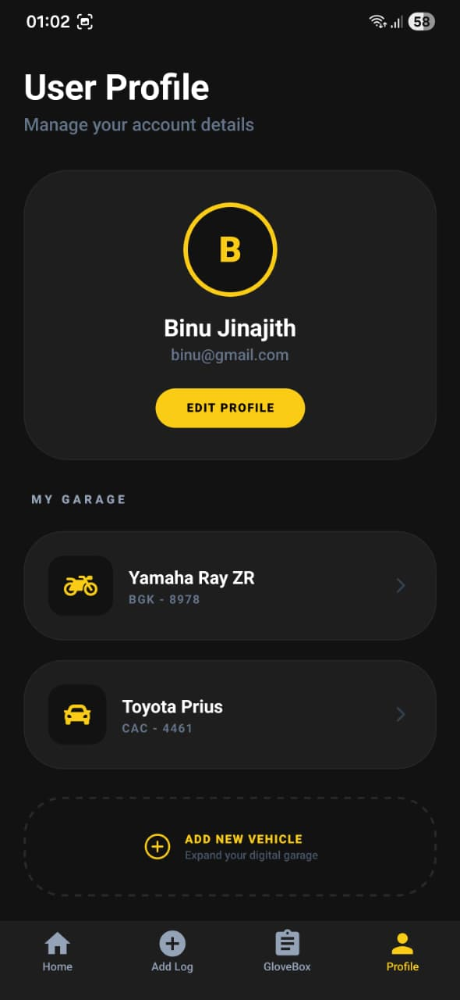

# AutoLog 🚗 
**Premium Vehicle Maintenance & Document Management System**

AutoLog is a high-end mobile utility application designed for vehicle owners to digitize their maintenance logbooks, track fuel consumption, and manage critical legal documents. Built with a focus on premium user experience (UX) and real-time data synchronization.

---

## 📦 Mobile Build (APK)
You can download the compiled Android binary for testing here:

- **Direct Download:** [👉 Download AutoLog APK](https://expo.dev/accounts/binu0714/projects/AutoLog/builds/247cbe59-99c5-4b16-acf2-a8d3b7a6615d)

---

## 📸 App Screenshots

| Welcome Screen | Login Page |
| :---: | :---: |
|  |  |
| **Sign Up Page** | **Vehicle Setup** |
|  |  |
| **Home Dashboard** | **Digital Glovebox** |
|  |  |
| **Add Fuel Log** | **Add Service Log** |
|  |  |
| **Activity History** | **User Profile** |
|  |  |

## 📱 Core Features
- **Security & Auth:** Secure user registration and login using **Firebase Authentication**.
- **Smart Onboarding:** Interactive setup wizard to profile specific vehicles (Car, Bike, Van, Lorry).
- **Dashboard (Read):** Real-time summary of mileage, total vehicle expenditure, and maintenance status.
- **Activity Logs (Create/Read):** Log fuel refills and service records (Oil changes, repairs) with automated formatting.
- **Digital Glovebox (CRUD):** A document vault to manage Insurance, Revenue Licenses, and Emission test expiry dates with real-time countdown logic.
- **Garage Management:** Seamlessly switch between multiple vehicles and update specifications.

---

## 🛠️ Technical Stack
- **Framework:** React Native (Expo SDK 54)
- **Language:** TypeScript
- **Styling:** NativeWind (Tailwind CSS)
- **Database:** Cloud Firestore (NoSQL)
- **Authentication:** Firebase Auth
- **Persistence:** AsyncStorage (Local primary vehicle tracking)
- **Navigation:** Expo Router (File-based routing)

---

## 🚀 Getting Started

### 1. Prerequisites
- **Node.js** (v18 or higher)
- **Expo Go** app on your mobile device OR an **Android Emulator** (Android Studio)

### 2. Installation
```bash
# Clone the repository
git clone https://github.com/Binu0714/AutoLog.git

# Navigate to the project folder
cd AutoLog

# Install dependencies
npm install
```

### 3. Environment Configuration
Create a .env file in the root directory and add your Firebase project credentials. This is required for the app to connect to the backend.
````
EXPO_PUBLIC_ApiKey=your_firebase_api_key
EXPO_PUBLIC_AuthDomain=your_project_id.firebaseapp.com
EXPO_PUBLIC_ProjectId=your_project_id
EXPO_PUBLIC_StorageBucket=your_project_id.appspot.com
EXPO_PUBLIC_MessagingSenderId=your_sender_id
EXPO_PUBLIC_AppId=your_app_id
````

### 4. Running the App
````
# Start the Metro Bundler with a clear cache
npx expo start -c
````

### 📁 Project Architecture
````
AutoLog/
├── app/ # Application routes and layouts (Expo Router)
├── components/ # Reusable UI elements (Cards, Modals, etc.)
├── context/ # Global state providers (Auth, Alerts, Loading state)
├── hooks/ # Custom React hooks
├── services/ # Firestore and Auth business logic
├── assets/ # Images, icons, splash screens
│ ├── images/
│ └── icons/
├── .env # Firebase credentials
├── package.json # Project dependencies
└── README.md # Project documentation
````

---

### ✍️ Author

**Binu Rajakaruna** – Software Engineering Student   
- **LinkedIn:** ([https://www.linkedin.com/feed/](https://www.linkedin.com/in/binu-jinajith/))

---


